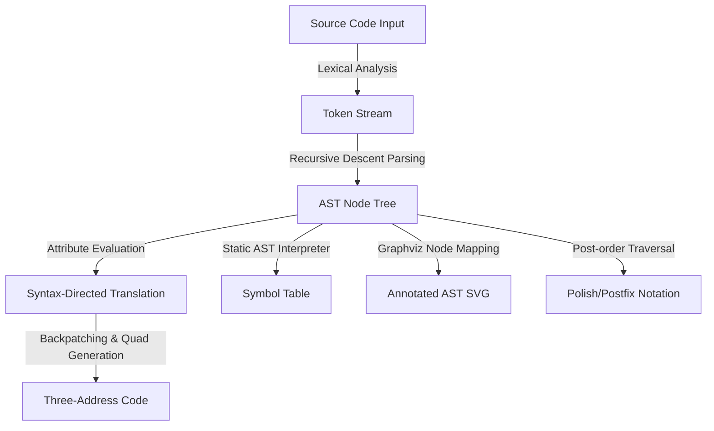

# ⚙️ Compiler Design Web Visualizer & TAC Generator

<p align="center">
  
  
  
  
  
  
  
</p>

An interactive, premium-designed web-based dashboard and compiler pipeline visualizer. This tool parses a simple C-like language featuring arithmetic assignments, relational booleans, conditional branchings (if/else), and while loops, translating them into syntax-directed Three-Address Code (TAC) and Polish notation, with full AST mapping and symbol table tracking.

                    LIVE AT : https://threeaddressgenerator.streamlit.app/

---

## 🚀 Features

- **Lexical Analysis (Tokenization)**: Converts source code into distinct tokens with token types, values, and precise line references.
- **Annotated AST Visualizer**: Automatically generates a dark-themed, beautiful graphical syntax tree using Graphviz, mapping statements, booleans, and arithmetic nodes, with a text-based tree fallback.
- **Interactive Three-Address Code (TAC)**: Emits intermediate representation quads and performs backpatching on boolean short-circuits, control-flow statements, and loops.
- **Typewriter Reveal Effect**: Animates TAC generation line-by-line upon compilation to visualize intermediate emission steps.
- **Static AST Interpreter & Symbol Table**: Runs a compile-time execution pass on the statement AST to resolve variable states, names, data types, and declaration lines in a structured database representation.
- **Presets & Custom Inputs**: Load pre-constructed templates (Arithmetic, If/Else, While Loops, Boolean relations) or edit and compile custom programs freely.

---

## 🎨 System Architecture & Workflow



---

## 🛠️ Technologies Used

- **Python 3.13** (Core compiler implementation: Lexer, Parser, IR generator, AST interpreter)
- **Streamlit** (Web-based dashboard layout and stateful interactions)
- **Graphviz** (Structural syntax tree diagram rendering)
- **Pandas** (Symbol table tabular formatting)
- **Pytest** (Automated compiler unit testing)

---

## 📂 Project Structure

```text
threeaddrgen/
├── app.py            # Streamlit dashboard entrypoint & custom styled layout
├── lexer.py          # Regex-based scanner / tokenizer
├── parser.py         # Recursive-descent grammar parser generating Node objects
├── ast_nodes.py      # AST Node class definitions and textual representation
├── attributes.py     # Attribute evaluator (SDT) emitting intermediate quads
├── backpatch.py      # Backpatching routines for target jump address resolution
├── tac.py            # Intermediate representation structures (Quads) and state
├── postfix.py        # Post-fix converter traversing AST expression nodes
├── interpreter.py    # Static evaluator constructing the Symbol Table env
├── visualizer.py     # Dark-themed Graphviz Digraph builder for the AST
├── tests/            # Parser, lexer, statements, and integration test suite
├── requirements.txt  # Project library dependencies
└── .gitignore        # Configured build/caching excludes
```

---

## 📥 Installation & Setup

### Requirements
- **Python 3.10+**
- **Graphviz** installed on your system path.
  - *Windows*: Download from [Graphviz Downloads](https://graphviz.org/download/) and add `bin/` to your User Environment PATH.
  - *macOS*: `brew install graphviz`
  - *Linux*: `sudo apt-get install graphviz`

### Local Deployment
1. **Clone the Repository**:
   ```bash
   git clone https://github.com/PokuriLahari/THREEADDRGEN.git
   cd THREEADDRGEN
   ```

2. **Create and Activate a Virtual Environment**:
   ```bash
   python -m venv venv
   # Windows:
   venv\Scripts\activate
   # macOS/Linux:
   source venv/bin/activate
   ```

3. **Install Dependencies**:
   ```bash
   pip install -r requirements.txt
   ```

4. **Run Streamlit**:
   ```bash
   streamlit run app.py
   ```

---

## 💻 Usage & Verification

### Run Compiler Tests
To run the automated test suite verifying parsing, lexing, and attribute rules:
```bash
python -m pytest
```

### Example Input
```text
sum = 0;
i = 1;
while (i <= 5) {
    sum = sum + i;
    i = i + 1;
}
```

### Generated Outputs

#### 1. Three-Address Code (TAC)
```text
0: sum = 0
1: i = 1
2: if i <= 5 goto 4
3: goto 8
4: t0 = sum + i
5: sum = t0
6: t1 = i + 1
7: i = t1
8: goto 2
```

#### 2. Symbol Table
| Name | Type | Value | Line Declared |
| :--- | :--- | :---- | :------------ |
| sum  | int  | 15    | 1             |
| i    | int  | 6     | 2             |

#### 3. Visual AST
The dashboard generates a full graphical syntax tree styled in the visualizer's dark palette:
*(See screenshot placeholder below)*

---

## 📸 Screenshots

<p align="center">
  
  <br>
  <em>Figure 1: Dashboard with live dark-themed AST rendering, typewriter TAC animation, and Symbol Table data view.</em>
</p>

---

## 🎓 Learning Outcomes
- Designing recursive-descent parsers for conditional branch control flow.
- Translating structural logic statements into multi-target boolean short-circuit representations.
- Understanding backpatching jump lists in one-pass intermediate code generators.
- Practical state management and UI modularity inside Streamlit apps.

---

## 📜 License
This project is licensed under the **MIT License**. See the `LICENSE` file for details.

---

## 👤 Author
**Pokuri Lahari**
- GitHub: [@PokuriLahari](https://github.com/PokuriLahari)
